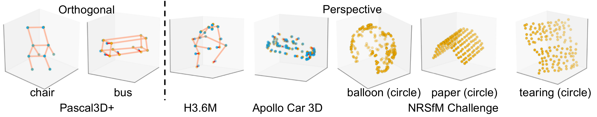
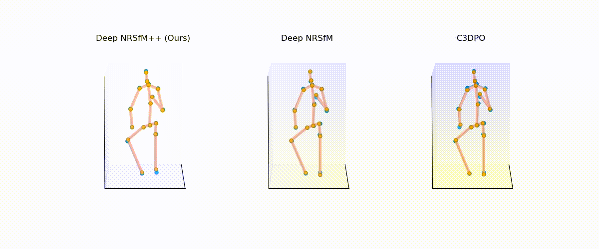
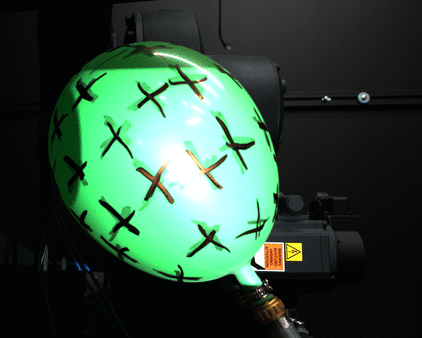
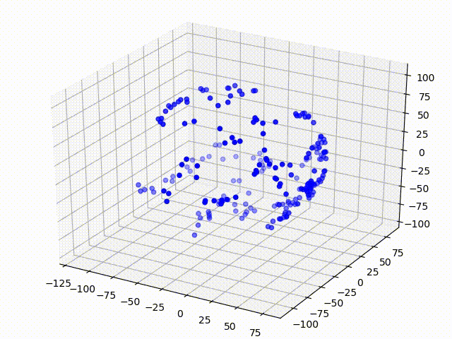
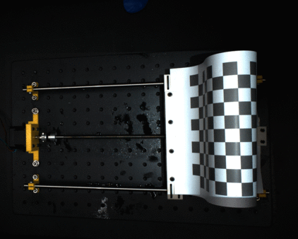
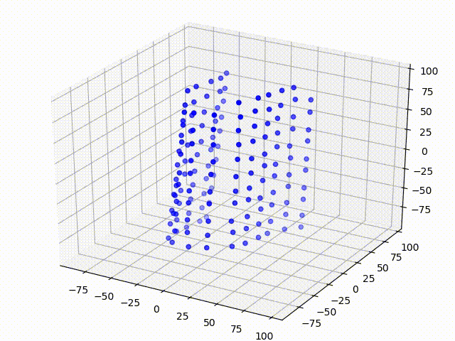

# Deep NRSfM++

This repository will contain code for the Deep NRSfM++ method.

Paper:[https://arxiv.org/pdf/2001.10090.pdf]

 
---
### Result on H3.6M 

---
### Result on NRSfM Challenge (balloon circle & paper circle)
| |  |  | |
